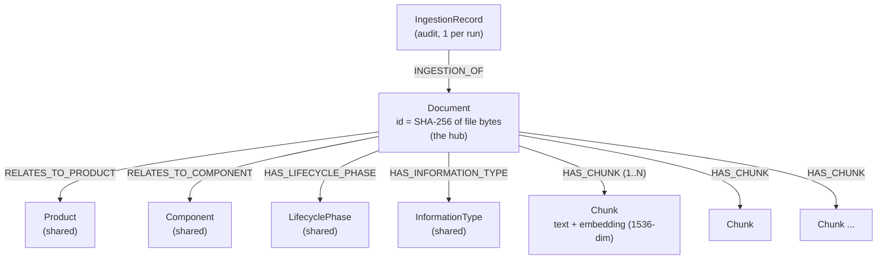
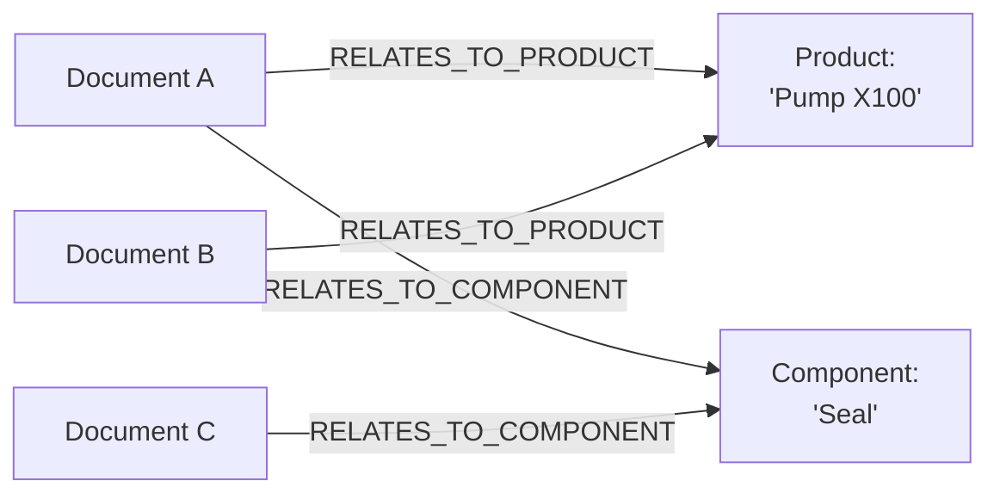
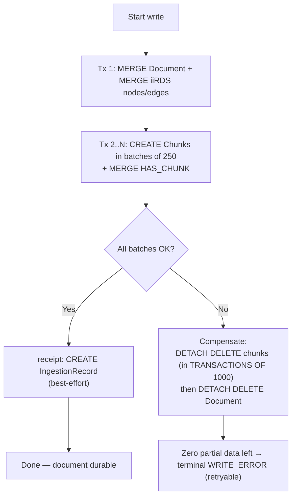

# Neo4j Graph Schema — How Ingested Documents Are Stored

**Scope:** This document describes the *exact* shape of the graph that the ingestion pipeline writes into Neo4j: every node label, every property, every relationship type, the order in which they are written, and the atomicity guarantees around the write. It is a reference for anyone querying the graph, debugging an ingestion, or extending the schema.

**Source of truth:** The schema is defined entirely in code — there is no separate `.cypher` schema file. The authoritative definitions live in:
- `rag/ingestion/nodes.py` — the `neo4j_write` and `receipt` nodes (node/relationship Cypher). See `_DOC_CYPHER`, `_CHUNK_CYPHER`, `_IIRDS_RELS`.
- `rag/clients/neo4j_client.py` — the unique constraint + vector index + full-text index DDL.
- `rag/config.py` — invariants (`EMBEDDING_DIMENSIONS = 1536`, `EMBEDDING_SIMILARITY = "cosine"`, write batch size).

**Companion docs:** `NEO4J_SETUP.md` (install/run the database), `REQUIREMENTS.md` (FR-7.x graph writes, FR-S0.5 index bootstrap), `USER_MANUAL.md` (running an ingestion).

> **Caveat on accuracy:** The tables below were transcribed from the code listed above as of this writing. If the Cypher in `rag/ingestion/nodes.py` changes, this document can drift — treat the code as canonical and update this file alongside any schema change.

---

## 1. Overview — a document-centric "hub-and-spoke" graph

When you ingest one document, the pipeline produces **one `:Document` node** (the hub) surrounded by three kinds of spokes:

1. **Content spokes** — one `:Chunk` node per text chunk, each carrying the chunk text **and its embedding vector**.
2. **Metadata spokes** — a handful of **iiRDS** classification nodes (`:Product`, `:Component`, `:LifecyclePhase`, `:InformationType`). These are **shared across documents**, so they are what connect otherwise-independent documents into a single graph.
3. **Audit spoke** — one `:IngestionRecord` node per successful ingestion run, written by the `receipt` stage.



Plain-ASCII version of the same shape (for terminals/diff tools that don't render Mermaid):

```
        ┌────────────────┐  INGESTION_OF
        │ IngestionRecord│──────────────┐
        │  (1 per run)   │              ▼
        └────────────────┘        ┌──────────────┐
                                  │   Document   │
  RELATES_TO_PRODUCT  ◄───────────│ id = sha256  │───────────► HAS_INFORMATION_TYPE
   (:Product, shared)             │  (the hub)   │              (:InformationType, shared)
                                  └───┬───────┬──┘
  RELATES_TO_COMPONENT ◄──────────────┘       └───────────────► HAS_LIFECYCLE_PHASE
   (:Component, shared)                                          (:LifecyclePhase, shared)
                                      │ HAS_CHUNK (1..N)
                          ┌───────────┼───────────┐
                          ▼           ▼           ▼
                      ┌───────┐   ┌───────┐   ┌───────┐
                      │ Chunk │   │ Chunk │   │ Chunk │   text + embedding vector
                      └───────┘   └───────┘   └───────┘
```

> **There are no chunk-to-chunk edges.** Chunk order is stored as the integer `position` property on each `:Chunk`, *not* as a `NEXT`/`PREV` relationship. If you need chunks in reading order, sort by `position`.

---

## 2. Node labels

### 2.1 `:Document` — the hub (one per ingested file)

Created with `MERGE` on `id`, so re-running with the same file bytes targets the same node (the pipeline also rejects true duplicates upstream — FR-1.5).

| Property | Type | Source / meaning |
|---|---|---|
| `id` | string | **SHA-256 hex of the raw file bytes** — the canonical document id (FR-1.3). Backed by a uniqueness constraint. |
| `title` | string | Document title (derived during parse). |
| `file_path` | string | Original source path of the ingested file. |
| `ingested_at` | string (ISO-8601 UTC) | Timestamp of the write. |
| `chunk_count` | integer | Number of `:Chunk` nodes attached. |
| `language` | string \| null | Detected language from iiRDS tagging (may be null). |

### 2.2 `:Chunk` — content + embedding (one per chunk)

Created with `CREATE` (not MERGE) inside `UNWIND $chunks`, in batches. The embedding is set with `db.create.setNodeVectorProperty(c, 'embedding', ch.embedding)` so Neo4j stores it as a true vector property.

| Property | Type | Meaning |
|---|---|---|
| `id` | string | Unique chunk id. |
| `text` | string | The chunk's text content. Indexed by the full-text index. |
| `content_type` | string | Chunk content type (e.g. text/table). |
| `section_path` | string | Hierarchical section label; **begins with the document title** (the query layer relies on this). |
| `position` | integer | 0-based order of the chunk within the document. |
| `token_count` | integer | Token count (cl100k_base, the tokenizer billed for `text-embedding-3-small`). |
| `embedding` | vector(1536) | The embedding vector. **1536-dim, cosine** — must match the vector index exactly (NFR-REL-8). |

> **Embedding note:** The text actually sent to the embedding model is prefixed with `[Document: <title>] [Section: <section_path>]` for context (FR-6.3), but the `text` property stored on the node is the **raw** chunk text without that prefix.

### 2.3 iiRDS metadata nodes — **shared across documents**

All four are created with `MERGE` on `name`, so the *same* name resolves to the *same* node no matter how many documents reference it. This deduplication is what turns a pile of independent document trees into a connected graph.

| Label | Relationship from `:Document` | Cardinality | Key property |
|---|---|---|---|
| `:Product` | `RELATES_TO_PRODUCT` | 0..1 per doc | `name` |
| `:Component` | `RELATES_TO_COMPONENT` | 0..N per doc (multi-valued) | `name` |
| `:LifecyclePhase` | `HAS_LIFECYCLE_PHASE` | 0..1 per doc | `name` |
| `:InformationType` | `HAS_INFORMATION_TYPE` | 0..1 per doc | `name` |

Tag values come from the LLM tagging stage (`tag_iirds`), after closed-enum normalization; out-of-vocabulary values are dropped to null and produce **no** node/edge.

### 2.4 `:IngestionRecord` — audit (one per successful run)

Created in the `receipt` stage with `CREATE` and linked back to the document. Writing this node is **best-effort**: if it fails, the run still succeeds because the document is already durable (FR-8.2).

| Property | Type | Meaning |
|---|---|---|
| `ts` | string (ISO-8601 UTC) | When the run completed. |
| `status` | string | Pipeline status (e.g. `COMPLETED`). |
| `chunk_count` | integer | Chunks written this run. |
| `total_tokens` | integer | Total tokens processed. |
| `cost_usd` | float \| null | Estimated embedding cost. |
| `low_confidence` | boolean | True if tagging confidence fell below the review threshold. |

---

## 3. Relationships (full list)

| Relationship | From → To | Created by | Notes |
|---|---|---|---|
| `HAS_CHUNK` | `(:Document) → (:Chunk)` | `MERGE` | One per chunk. |
| `RELATES_TO_PRODUCT` | `(:Document) → (:Product)` | `MERGE` | To a shared node. |
| `RELATES_TO_COMPONENT` | `(:Document) → (:Component)` | `MERGE` | To shared node(s); can be many. |
| `HAS_LIFECYCLE_PHASE` | `(:Document) → (:LifecyclePhase)` | `MERGE` | To a shared node. |
| `HAS_INFORMATION_TYPE` | `(:Document) → (:InformationType)` | `MERGE` | To a shared node. |
| `INGESTION_OF` | `(:IngestionRecord) → (:Document)` | `CREATE` | Audit link. |

### Why the graph connects: shared metadata

Two documents that share a product or component point at the **same** metadata node, so you can traverse from one document to another through them:



```
   Document A ──RELATES_TO_PRODUCT──┐
                                    ├──► (Product: "Pump X100")
   Document B ──RELATES_TO_PRODUCT──┘

   Document A ──RELATES_TO_COMPONENT─┐
                                     ├──► (Component: "Seal")
   Document C ──RELATES_TO_COMPONENT─┘
```

---

## 4. How the write happens (order + atomicity)

The per-document write is **not** a single transaction. Very large books once produced a single ~240k-command transaction that Neo4j failed to apply, wedging the database. The write is therefore split (FR-7.8, NFR-REL-1):

1. **Document + iiRDS edges** are written first, in one transaction — this gives the chunks an anchor `:Document` to `MATCH`.
2. **Chunks** are written in **batches of `neo4j_write_batch_chunks` (default 250)**, one transaction per batch, so no single transaction can grow large enough to fail.
3. The **`:IngestionRecord`** is written afterward in the `receipt` stage (best-effort).

Atomicity is preserved by **compensation**, not by one big transaction: if any batch fails, a cleanup deletes everything already committed for that document, leaving **zero partial data**.



> **Shared nodes survive cleanup.** Because iiRDS nodes are `MERGE`'d and shared, `DETACH DELETE` of the failed `Document` removes only *that document's* edges to them — never the shared `:Product`/`:Component`/etc. nodes that other documents still use.

---

## 5. Constraints & indexes (created at bootstrap)

Created idempotently by the bootstrap (FR-S0.5) and re-checked at write time (`rag/clients/neo4j_client.py`). These are what make retrieval work — the query layer does hybrid retrieval (vector + BM25/full-text + graph) against this exact schema.

| Name | Kind | Target | Purpose |
|---|---|---|---|
| `document_id_unique` | Uniqueness constraint | `(:Document).id` | One node per document hash. |
| `chunk_embedding` | Vector index | `(:Chunk).embedding` | Semantic / similarity search. **1536 dims, cosine** (pulled from config so ingest and query can never drift). |
| `chunk_fulltext` | Full-text index | `(:Chunk).text` | Keyword / BM25 search (FR-7.6). |

---

## 6. Useful Cypher queries

**Visualize one document and its full neighborhood** (paste into Neo4j Browser at `http://localhost:7474`):

```cypher
MATCH (d:Document)
WITH d LIMIT 1
OPTIONAL MATCH (d)-[r]->(n)
OPTIONAL MATCH (rec:IngestionRecord)-[:INGESTION_OF]->(d)
RETURN d, r, n, rec;
```

**Chunks of a document, in reading order:**

```cypher
MATCH (d:Document {id: $doc_id})-[:HAS_CHUNK]->(c:Chunk)
RETURN c.position AS position, c.section_path AS section, c.text AS text
ORDER BY c.position;
```

**Find other documents related through a shared product:**

```cypher
MATCH (d:Document {id: $doc_id})-[:RELATES_TO_PRODUCT]->(p:Product)<-[:RELATES_TO_PRODUCT]-(other:Document)
WHERE other.id <> d.id
RETURN p.name AS product, collect(other.title) AS related_documents;
```

**Count what's in the graph:**

```cypher
MATCH (d:Document)         WITH count(d) AS documents
MATCH (c:Chunk)            WITH documents, count(c) AS chunks
MATCH (p:Product)          WITH documents, chunks, count(p) AS products
RETURN documents, chunks, products;
```

---

## 7. Schema at a glance (cheat sheet)

```
NODES
  (:Document   {id, title, file_path, ingested_at, chunk_count, language})   -- MERGE on id
  (:Chunk      {id, text, content_type, section_path, position, token_count, embedding})  -- CREATE
  (:Product          {name})   -- MERGE on name, SHARED
  (:Component        {name})   -- MERGE on name, SHARED
  (:LifecyclePhase   {name})   -- MERGE on name, SHARED
  (:InformationType  {name})   -- MERGE on name, SHARED
  (:IngestionRecord  {ts, status, chunk_count, total_tokens, cost_usd, low_confidence})  -- CREATE

RELATIONSHIPS
  (:Document)-[:HAS_CHUNK]->(:Chunk)
  (:Document)-[:RELATES_TO_PRODUCT]->(:Product)
  (:Document)-[:RELATES_TO_COMPONENT]->(:Component)
  (:Document)-[:HAS_LIFECYCLE_PHASE]->(:LifecyclePhase)
  (:Document)-[:HAS_INFORMATION_TYPE]->(:InformationType)
  (:IngestionRecord)-[:INGESTION_OF]->(:Document)

INDEXES / CONSTRAINTS
  document_id_unique   CONSTRAINT  (:Document).id UNIQUE
  chunk_embedding      VECTOR      (:Chunk).embedding   1536-dim, cosine
  chunk_fulltext       FULLTEXT    (:Chunk).text
```
