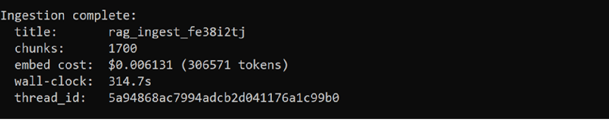
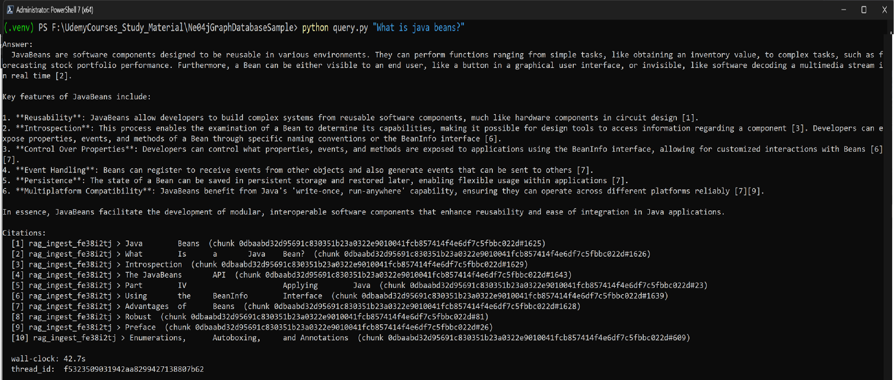
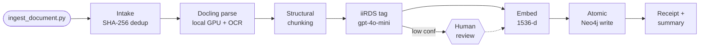
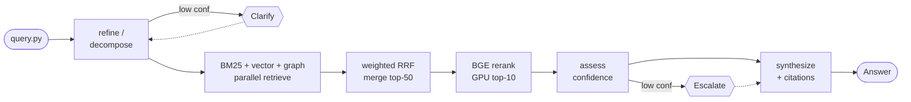

# graphrag-pipeline — Local Graph RAG (Ingestion + Query)

> A local, single-user **Retrieval-Augmented Generation** system over technical documentation, built on **LangGraph** and a **Neo4j knowledge graph**, with hybrid retrieval (BM25 + vector + graph), a **local GPU cross-encoder re-ranker**, and durable human-in-the-loop checkpointing.

<p>


</p>

This project turns a folder of technical documents (product manuals, spec sheets, troubleshooting guides) into a queryable knowledge base, then answers natural-language questions against it **with citations**. It is deliberately **hybrid**: heavy reasoning and embeddings run in the cloud (OpenAI), while document parsing, OCR, and cross-encoder re-ranking run **locally on the GPU** — minimizing data egress and per-query cost.

📖 **Full documentation:** [**User Manual**](./USER_MANUAL.md) · [**Requirements & design spec**](./REQUIREMENTS.md) (decisions D1–D17, every NFR)

---

## Demo

<!--
  PLACEHOLDER — replace the two images below with real terminal captures:
    docs/demo-ingest.png  →  output of: python ingest_document.py samples\acme_pump_manual.md
                             (the "Ingestion complete: title / chunks / cost / time" summary)
    docs/demo-query.png   →  output of: python query.py "What is the rated flow of the pump?"
                             (the "Answer: ... / Citations: [1] ... / thread_id" block)
  Create the folder (e.g. `mkdir docs`), drop the PNGs in, and the links below render on GitHub.
  Tip: keep captures ~900px wide and crop to just the relevant output for a clean LinkedIn preview.
-->

**Ingesting a document** — atomic write into the Neo4j graph with a cost + timing summary:



**Asking a question** — a cited answer synthesized from the top re-ranked chunks:



> _Screenshots coming soon. To regenerate: run the two commands in [Quick start](#quick-start) and capture the terminal output._

---

## Why this is interesting

This is not a "embed-and-cosine" RAG demo. The engineering choices are the point:

- 🧠 **Two LangGraph state machines** — ingestion (write) and query (read) — with typed pydantic state, conditional routing, and per-stage timings.
- 💾 **Durable, resumable human-in-the-loop** — low-confidence tags, ambiguous queries, and low-confidence retrievals **pause and checkpoint to Postgres**, then resume by `thread_id` — surviving process *and* database restarts.
- ⚛️ **Atomic, all-or-nothing graph writes** — a failure leaves **zero** partial data; the file is safe to re-submit.
- 🔁 **Exactly-once ingestion** via SHA-256 dedup — re-submitting the same bytes costs **nothing** (zero OpenAI calls).
- 🧩 **Structure-aware chunking** — tables, lists, and safety warnings stay as single unfragmented chunks; prose is packed to 512 tokens with sentence-boundary overlap.
- 🔀 **Always-parallel hybrid retrieval** — BM25 + vector + graph run for *every* query; the query class **re-weights** them via **weighted Reciprocal Rank Fusion** (scale-invariant, degrades for free).
- 🎯 **Local GPU cross-encoder re-ranking** (`BAAI/bge-reranker-v2-m3`) — more accurate than bi-encoder cosine, free per call, and the retrieved text never egresses.
- 🚦 **Composite-confidence escalation gate** — escalates to a human instead of returning a confident-sounding weak answer.
- 🔧 **No magic numbers** — every tunable is externalized to `.env` with a documented schema.

---

## Architecture

```
┌──────────────── Laptop (Windows 11, Python 3.13) ──────────────────┐
│   Python process                       Bolt :7687                   │
│   • LangGraph ingestion + query  ◄────────────────►  Neo4j (Docker) │
│   • Docling / EasyOCR (GPU)                          graph + vector  │
│   • BGE re-ranker      (GPU)                         + full-text idx │
│   • LangGraph checkpointer       psql :5432                          │
│                                  ◄────────────────►  Postgres        │
│                  │ HTTPS                              (native on-prem)│
└──────────────────┼──────────────────────────────────────────────────┘
                   ▼   OpenAI API (gpt-4o-mini · text-embedding-3-small)
```

### Ingestion flow (write path)



### Query flow (read path)



> Step-by-step descriptions of every node are in the [User Manual](./USER_MANUAL.md#7-ingestion-flow-write-path).

---

## Tech stack

| Concern | Technology |
|---|---|
| Orchestration / state / resume | LangGraph + Postgres checkpointer (`langgraph-checkpoint-postgres`) |
| Document parsing | Docling (DocLayNet layout + TableFormer tables) |
| OCR (local, GPU) | EasyOCR via `docling[easyocr]` |
| LLM (tagging, reasoning, synthesis) | OpenAI `gpt-4o-mini` (synthesis configurable to `gpt-4o`) |
| Embeddings | OpenAI `text-embedding-3-small` (1536-dim, cosine) |
| Cross-encoder re-ranker (local, GPU) | `BAAI/bge-reranker-v2-m3` via FlagEmbedding (fp16, CUDA) |
| Knowledge graph | Neo4j (Docker) — vector + full-text (Lucene/BM25) indexes |
| Checkpoint store | Postgres (native on-prem) |
| Local ML runtime | PyTorch CUDA build on an NVIDIA RTX 4090 |

---

## Quick start

> **Prerequisites:** Windows 11, Python 3.13, an NVIDIA CUDA GPU, Docker Desktop, a native Postgres install, and an OpenAI API key. Full setup (incl. the CUDA-torch caveat) is in the [User Manual §4](./USER_MANUAL.md#4-installation--setup).

```powershell
# 1. Environment
py -3.13 -m venv .venv ; .\.venv\Scripts\Activate.ps1
pip install torch==2.11.0+cu128 torchvision==0.26.0+cu128 --index-url https://download.pytorch.org/whl/cu128
pip install -r requirements.txt

# 2. Services + config
docker compose up -d                # Neo4j  (see NEO4J_SETUP.md)
copy .env.example .env              # fill in OPENAI_API_KEY, passwords (see POSTGRES_SETUP.md)

# 3. One-time bootstrap: assert CUDA, cache weights, create indexes + tables
python setup_models.py              # prints "environment ready"

# 4. Use it
python ingest_document.py samples\acme_pump_manual.md
python query.py "What is the rated flow of the pump?"
```

---

## Command reference

| Command | Purpose | Exit codes |
|---|---|---|
| `python setup_models.py` | One-time environment bootstrap | `0` ready · non-zero NOT ready |
| `python ingest_document.py <path>` | Ingest one document | `0` ok · `1` error · `3` duplicate · `4` suspended |
| `python review_tags.py <thread_id>` | Resume ingestion at tag review | `0`/`1`/`3`/`4` |
| `python query.py "<question>"` | Ask one question (cited answer) | `0` ok · `1` error · `4` suspended |
| `python resume_query.py <thread_id>` | Resume query at clarification/escalation | `0`/`1`/`4` |
| `python calibrate_confidence.py [queries.txt]` | Offline harness to tune the escalate threshold | `0` ok |

---

## Documentation

| Document | What's in it |
|---|---|
| [**USER_MANUAL.md**](./USER_MANUAL.md) | Install, config reference, ingestion/query flows, CLI reference, human-in-the-loop ops, observability, cost, troubleshooting, **how to extend**, calibration, FAQ. |
| [**REQUIREMENTS.md**](./REQUIREMENTS.md) | The functional/non-functional contract: decisions D1–D17, every FR/NFR, acceptance criteria, risks, the rationale for every local-vs-cloud placement. |
| [NEO4J_SETUP.md](./NEO4J_SETUP.md) | Neo4j (Docker) provisioning. |
| [POSTGRES_SETUP.md](./POSTGRES_SETUP.md) | Postgres (native on-prem) provisioning. |

---

## Scope & honest caveats

Built for a **single user, from the CLI**. Out of scope by design: multi-user concurrency, a web UI/REST API, auth, document deletion, and in-place re-ingestion. The cross-encoder is strict, so on the small sample corpus queries escalate more often than on a real corpus — the included `calibrate_confidence.py` is how you retune the threshold. See the [full caveats](./USER_MANUAL.md#13-known-limitations--caveats) before relying on it.

---

## License

[MIT](./LICENSE) © 2026 Suryakant Verma
