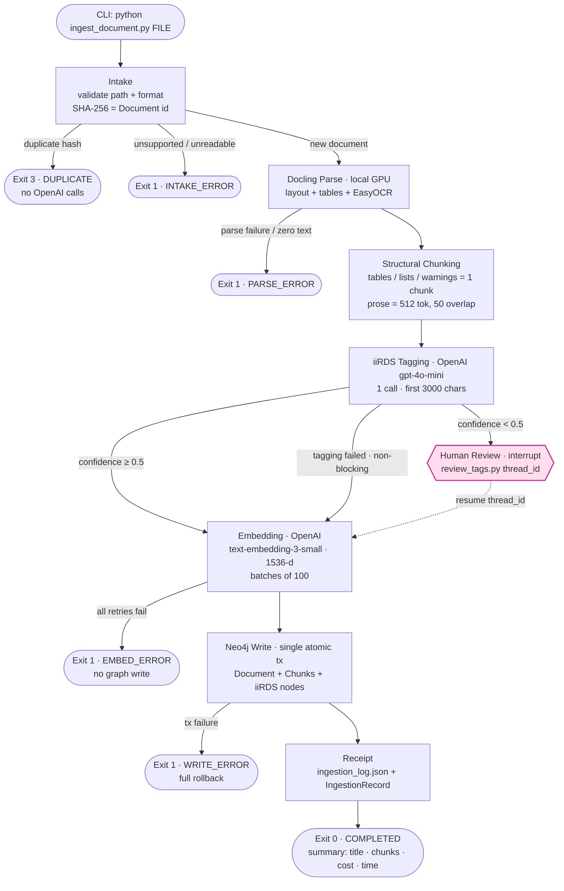
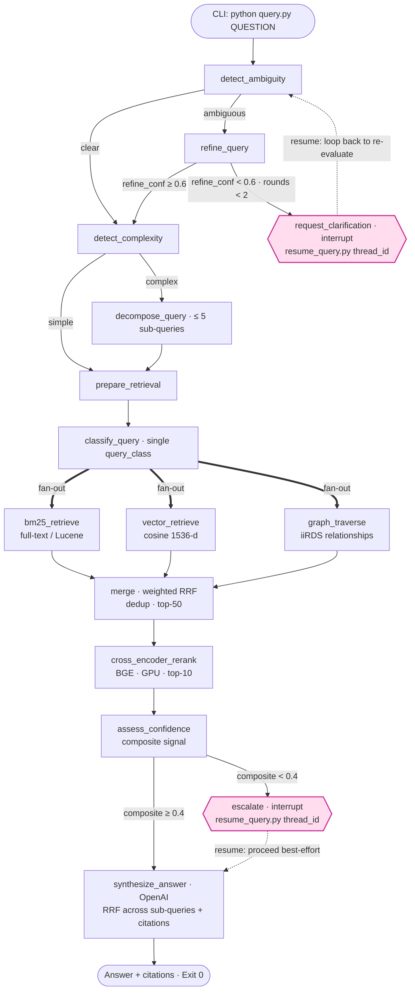

# User Manual — Local Graph RAG Pipeline (Ingestion + Query)

**A local, single-user Retrieval-Augmented Generation system over technical documentation, built on LangGraph and a Neo4j knowledge graph with hybrid retrieval and a local GPU re-ranker.**

| | |
|---|---|
| **Document** | User & Operator Manual |
| **Applies to** | Pipeline build verified 2026‑06‑16 (ingestion + query paths complete) |
| **Spec of record** | [`REQUIREMENTS.md`](./REQUIREMENTS.md) v2.7 (functional/non‑functional contract, decisions D1–D17) |
| **Platform** | Windows 11, Python 3.13 (running 3.13.11 — see [§3.1](#31-prerequisites)) |
| **Status** | Working end‑to‑end; honest caveats in [§13](#13-known-limitations--caveats) |

> This manual is written to the "be explicit, assume nothing" standard: every command, value, and behavior is stated rather than implied, package versions are the ones actually installed and verified, and known rough edges are called out honestly rather than glossed over.

---

## Table of Contents

1. [What this system is](#1-what-this-system-is)
2. [Salient features](#2-salient-features)
3. [Before you begin](#3-before-you-begin)
   - [3.1 Prerequisites](#31-prerequisites)
   - [3.2 Architecture at a glance](#32-architecture-at-a-glance)
   - [3.3 What leaves your machine (data egress)](#33-what-leaves-your-machine-data-egress)
4. [Installation & setup](#4-installation--setup)
5. [Quick start](#5-quick-start)
6. [Configuration reference](#6-configuration-reference)
7. [Ingestion flow (write path)](#7-ingestion-flow-write-path)
8. [Query flow (read path)](#8-query-flow-read-path)
9. [Command-line reference](#9-command-line-reference)
10. [Human-in-the-loop operations](#10-human-in-the-loop-operations)
11. [Observability: logs, receipts, run state](#11-observability-logs-receipts-run-state)
12. [Cost model](#12-cost-model)
13. [Known limitations & caveats](#13-known-limitations--caveats)
14. [Troubleshooting](#14-troubleshooting)
15. [Extending the system](#15-extending-the-system)
16. [Calibrating confidence thresholds](#16-calibrating-confidence-thresholds)
17. [Glossary](#17-glossary)
18. [FAQ](#18-faq)

---

## 1. What this system is

This is a two‑pipeline RAG system that turns a folder of technical documents (product manuals, spec sheets, troubleshooting guides) into a queryable knowledge base, and then answers natural‑language questions against it with citations.

- **Ingestion (write path)** — parses a document locally, splits it into structure‑aware chunks, tags it with iiRDS metadata, embeds it, and writes it atomically into a Neo4j knowledge graph.
- **Query (read path)** — takes a natural‑language question, disambiguates and (if needed) decomposes it, runs three retrievers in parallel, fuses and re‑ranks the results locally, assesses confidence, and synthesizes a cited answer.

Both pipelines are **LangGraph state machines** with durable checkpointing in Postgres, so any run that pauses for human input survives a process or service restart and resumes by `thread_id`.

It is **deliberately hybrid**: heavy reasoning and embeddings run in the **cloud (OpenAI)**, while document parsing, OCR, and cross‑encoder re‑ranking run **locally on the GPU**. The rationale for every component's placement is documented in `REQUIREMENTS.md` §1.5.

**Intended audience:** a single developer/operator running the pipeline locally from the command line. It is not a multi‑user service — see [§13](#13-known-limitations--caveats) for scope boundaries.

---

## 2. Salient features

These are the engineering decisions worth highlighting — the things that make this more than a toy RAG demo.

| Feature | What it means in practice |
|---|---|
| **LangGraph state machines, end to end** | Both pipelines are explicit, typed `StateGraph`s with conditional routing. Every stage is an independently testable node with pydantic‑typed I/O. |
| **Durable checkpointing + resumable human‑in‑the‑loop** | A run that pauses (low‑confidence tags, ambiguous query, low‑confidence retrieval) persists full state to Postgres and resumes later by `thread_id` — surviving process exit and even a Postgres restart. |
| **Atomic, all‑or‑nothing graph writes** | The entire document is written to Neo4j in a single transaction. A failure leaves **zero** partial data; the file is safe to re‑submit. |
| **Exactly‑once ingestion via SHA‑256 dedup** | The document hash is its canonical id. Re‑submitting the same bytes terminates cleanly as a duplicate with **no OpenAI calls** (zero cost). |
| **Structure‑aware chunking** | Tables, lists, and safety warnings are each kept as one unfragmented chunk; prose is packed to 512 tokens with 50‑token sentence‑boundary overlap. Section paths are carried as chunk context. |
| **Hybrid retrieval, always parallel** | BM25 (lexical), vector (semantic), and graph (relational) retrieval **all** run for every query. The query class re‑weights their contributions; it never disables a retriever. |
| **Weighted Reciprocal Rank Fusion (RRF)** | Rank‑based fusion is scale‑invariant across the incompatible Lucene/cosine/graph score scales, and a retriever returning nothing degrades for free. One shared RRF helper serves both merge‑time and synthesis‑time fusion. |
| **Local GPU cross‑encoder re‑ranking** | `BAAI/bge-reranker-v2-m3` scores every (query, chunk) pair on the GPU — more accurate than bi‑encoder cosine, free per call, low‑latency, and the retrieved chunk text never egresses for re‑ranking. |
| **Composite confidence + escalation gate** | A weighted signal (top score, avg top‑3, rank‑1/rank‑2 gap) decides whether to answer or escalate to a human, rather than returning a confident‑sounding weak answer. |
| **Closed iiRDS vocabularies** | `lifecycle_phase` and `information_type` are validated against config‑defined enums; out‑of‑vocabulary values are normalized or rejected. `product`/`component` are open free‑text, `MERGE`d for cross‑document dedup. |
| **No magic numbers** | Every tunable (chunk size, thresholds, top‑K, loop caps, model names, devices) is externalized to `.env` with a documented schema and a shipped `.env.example`. |
| **Structured JSON logging + audit trail** | Structured logs (console + rotating file) carry `thread_id`/pipeline/stage on every record; secrets and full payloads are never logged. A separate append‑only `ingestion_log.json` and a Neo4j `IngestionRecord` form the durable audit trail. |
| **Explicit bootstrap** | A one‑time `setup_models.py` asserts CUDA, downloads/caches all local weights, smoke‑tests each on the GPU, and creates Neo4j indexes + Postgres tables — so first ingest/query needs no downloads and fails fast if the environment is wrong. |
| **Distinguishable exit codes** | `0` success · `1` error · `3` duplicate · `4` suspended — scriptable and unambiguous. |

---

## 3. Before you begin

### 3.1 Prerequisites

**Hardware (verified target, 2026‑06‑15):**

- **NVIDIA GPU with CUDA** — verified on an **RTX 4090 Laptop GPU (16 GB VRAM)**, driver 596.36, CUDA 13.2 (Ada / sm_89). A CUDA GPU is **required** by default; the re‑ranker and OCR will fall back to CPU (slower) only if explicitly forced.
- VRAM budget: the BGE re‑ranker is ≈0.5 GB in fp16; Docling models are modest. 16 GB leaves ample headroom.

**Software:**

| Component | Version (verified) | Notes |
|---|---|---|
| Python | **3.13.11** | `REQUIREMENTS.md` pins 3.13.14, but that patch does not exist; the build runs on 3.13.11 (the latest 3.13 patch). See the caveat in [§13](#13-known-limitations--caveats). |
| Docker Desktop | current | Hosts the Neo4j container. Must be installed and running. |
| Neo4j (Docker) | **2026.x** | Native vector + full‑text (Lucene/BM25) indexes. Provisioned via `docker-compose.yml`. See [`NEO4J_SETUP.md`](./NEO4J_SETUP.md). |
| Postgres (native, on‑prem) | **18.1** (14+ supported) | The LangGraph checkpoint store. Runs **natively on the laptop** (localhost:5432), **not** in Docker. See [`POSTGRES_SETUP.md`](./POSTGRES_SETUP.md). |
| PyTorch | **2.11.0+cu128** (+ torchvision 0.26.0+cu128) | Must be the **CUDA build**, installed from the PyTorch CUDA wheel index — not the default CPU wheel. |
| transformers | **4.57.6** (`<5.0`) | 5.x removes an API FlagEmbedding 1.4.0 depends on. |

> **Version rigor note.** The versions above are the ones actually installed and verified, not aspirational pins. `requirements.txt` bakes in several hard‑won pins (CUDA torch, `transformers<5.0`, FlagEmbedding instead of sentence‑transformers). Do not "upgrade to latest" blindly — read the pin comments first.

**Accounts:**

- An **OpenAI API key** with quota for `gpt-4o-mini` and `text-embedding-3-small`.
- (Optional) A **Hugging Face token** for higher model‑download rate limits (anonymous works, just slower/rate‑limited).

**Network:** Internet is required for ingestion tagging/embedding and query reasoning/synthesis (OpenAI). Re‑ranking and parsing work fully offline.

### 3.2 Architecture at a glance

```
┌──────────────── Laptop (Windows 11, Python 3.13) ──────────────────┐
│                                                                     │
│   Python process                       Bolt :7687                   │
│   • LangGraph ingestion + query  ◄────────────────►  Neo4j (Docker) │
│   • Docling / EasyOCR (GPU)                          graph + vector  │
│   • BGE re-ranker      (GPU)                         + full-text idx │
│   • LangGraph checkpointer       psql :5432                          │
│                                  ◄────────────────►  Postgres        │
│                                                      (native on-prem)│
│                  │ HTTPS                              checkpoints     │
└──────────────────┼──────────────────────────────────────────────────┘
                   ▼
        OpenAI API   (gpt-4o-mini — tagging / query reasoning / synthesis;
                      text-embedding-3-small — chunk & query embeddings)
```

### 3.3 What leaves your machine (data egress)

This is a privacy‑sensitive system; be explicit about the boundary.

- **Leaves the device (sent to OpenAI):** the first 3000 characters of document text (for tagging), all chunk text (for embeddings, during ingestion), and the query text plus reasoning/synthesis context (during query).
- **Never leaves the device:** raw document bytes/files, OCR image data, the full retrieved chunk set during re‑ranking, the Neo4j graph, the embedding vectors at rest, and all run state.

> Sensitive or regulated content sent to OpenAI requires organizational approval. The LLM/embedding boundary is wrapped behind a thin internal interface to ease a future provider swap if needed.

---

## 4. Installation & setup

Perform these steps once. They follow the spec's required bootstrap path (D7).

### Step 1 — Clone and create a virtual environment

```powershell
git clone <your-repo-url> graphrag-pipeline
cd graphrag-pipeline
py -3.13 -m venv .venv
.\.venv\Scripts\Activate.ps1
python --version          # expect Python 3.13.11
```

### Step 2 — Install dependencies (CUDA torch first)

Install the CUDA PyTorch build **before** the rest, so the heavy pins resolve correctly and easyocr/torchvision can't silently pull a CPU wheel:

```powershell
pip install torch==2.11.0+cu128 torchvision==0.26.0+cu128 --index-url https://download.pytorch.org/whl/cu128
pip install -r requirements.txt
pip check                 # expect: "No broken requirements found."
```

Verify CUDA is visible to PyTorch:

```powershell
python -c "import torch; print(torch.cuda.is_available(), torch.cuda.get_device_name(0))"
# expect: True NVIDIA GeForce RTX 4090 Laptop GPU
```

> If this prints `False`, you have a CPU‑only torch build. Reinstall from the CUDA wheel index above. The bootstrap (Step 6) will fail fast with the same guidance.

### Step 3 — Start Neo4j (Docker)

```powershell
docker compose up -d        # reads NEO4J_PASSWORD from .env (Step 5)
```

Full details (volume persistence, browser access, credential setup) are in [`NEO4J_SETUP.md`](./NEO4J_SETUP.md).

### Step 4 — Install & start Postgres (native)

Postgres runs **natively** on the laptop (not Docker). Install it, then create the `langgraph` role and database. Step‑by‑step instructions (Windows installer, `psql` commands, troubleshooting) are in [`POSTGRES_SETUP.md`](./POSTGRES_SETUP.md). The bootstrap creates the checkpointer tables for you.

### Step 5 — Configure `.env`

Copy the template and fill in real values:

```powershell
copy .env.example .env
```

At minimum set `OPENAI_API_KEY`, `NEO4J_PASSWORD` (kept in sync with `docker-compose.yml`), and the Postgres credentials inside `CHECKPOINT_DB_URI` (kept in sync with `POSTGRES_USER`/`POSTGRES_PASSWORD`/`POSTGRES_DB`). See [§6](#6-configuration-reference) for the full schema. **Never commit `.env`** — it is git‑ignored.

### Step 6 — Run the bootstrap (required, one‑time)

```powershell
python setup_models.py
```

This single command (D7 / `REQUIREMENTS.md` §2.4):

1. Asserts `torch.cuda.is_available()` and logs the GPU name (fails fast with actionable guidance if only a CPU build is present).
2. Verifies Neo4j connectivity and idempotently creates the constraints/indexes (`document_id_unique`, the 1536‑dim cosine vector index `chunk_embedding`, the full‑text index `chunk_fulltext`).
3. Verifies Postgres connectivity and creates the LangGraph checkpointer tables.
4. Downloads and caches all local model weights (Docling DocLayNet + TableFormer, BGE re‑ranker, EasyOCR) and runs a GPU smoke inference on each.

On success it logs **`environment ready`** and exits `0`. On any failure it logs **`environment NOT ready`** plus the specific reason(s) and exits non‑zero. After a successful bootstrap, subsequent ingest/query runs perform **no** model downloads.

> First run downloads several hundred MB (Docling/BGE) + ~100 MB (EasyOCR). The Hugging Face endpoint occasionally connection‑resets; the downloader retries automatically.

---

## 5. Quick start

Three sample documents ship in `samples/`. After a successful bootstrap:

```powershell
# 1. Ingest a sample document
python ingest_document.py samples\acme_pump_manual.md

# 2. Ask a question
python query.py "What is the rated flow of the pump?"
```

Expected ingestion summary (values illustrative):

```
Ingestion complete:
  title:       ACME Pump Manual
  chunks:      10
  embed cost:  $0.000018 (920 tokens)
  wall-clock:  6.4s
  thread_id:   <uuid>
```

Expected query output:

```
Answer:
  The rated flow of the ACME pump is ...

Citations:
  [1] ACME Pump Manual > Specifications  (chunk <hash>#3)

  wall-clock: 3.2s
  thread_id:  <uuid>
```

---

## 6. Configuration reference

All settings come from environment variables (loaded from `.env`). A single typed pydantic config object validates them and is the one source consumed by both pipelines. **No magic numbers live in code.** Full schema source of truth: `REQUIREMENTS.md` §2.5.

**Secrets / connections**

| Variable | Default | Notes |
|---|---|---|
| `OPENAI_API_KEY` | — *(required)* | OpenAI auth; never committed. |
| `OPENAI_BASE_URL` | *(unset)* | Optional endpoint override. |
| `NEO4J_URI` | `bolt://127.0.0.1:7687` | localhost only. |
| `NEO4J_USER` | `neo4j` | |
| `NEO4J_PASSWORD` | — *(required)* | Change from default; also read by `docker-compose.yml`. |
| `NEO4J_DATABASE` | `neo4j` | |
| `CHECKPOINT_DB_URI` | `postgresql://langgraph:…@127.0.0.1:5432/langgraph` | LangGraph Postgres checkpointer; localhost only. |

**Models**

| Variable | Default | Notes |
|---|---|---|
| `LLM_MODEL` | `gpt-4o-mini` | Tagging + query reasoning. |
| `SYNTHESIS_MODEL` | `gpt-4o-mini` | Answer synthesis; raise to `gpt-4o` with no code change. |
| `EMBEDDING_MODEL` | `text-embedding-3-small` | Shared by ingest + query (must match — see below). |
| `RERANKER_MODEL` | `BAAI/bge-reranker-v2-m3` | Local cross‑encoder. |
| `RERANKER_DEVICE` | `cuda` | Fallback `cpu`. |
| `OCR_ENGINE` | `easyocr` | Locked. |
| `HF_TOKEN` | *(blank)* | Optional HF download token. |
| `HF_HOME` | `./.model_cache` | Local weight cache. |

**Parsing / Docling (PDF memory & cost controls)**

| Variable | Default | Meaning |
|---|---|---|
| `OCR_ENABLED` | `true` | OCR for scanned/image PDFs. Set `false` for large **born‑digital** PDFs (those with a real text layer) — OCR is the heaviest, most memory‑hungry parse stage and is unnecessary there. Biggest lever against `std::bad_alloc` on large books. |
| `PDF_MAX_PAGES` | `0` | Parse only the first N pages of a PDF (`0` = all). Bounds memory/time on very large documents. |
| `PDF_RENDER_DPI` | `72` | Page rasterization resolution (Docling `images_scale = dpi/72`). Lower (e.g. `48`) = smaller page bitmaps = less memory. `72` is the Docling default. |

> **Ingesting a large text PDF (e.g. a 1000+ page book).** The default OCR pipeline rasterizes every page and can exhaust memory (`std::bad_alloc`). For a born‑digital PDF, set `OCR_ENABLED=false` — that alone usually fixes it. For extreme cases, also cap pages (`PDF_MAX_PAGES=200`) or lower `PDF_RENDER_DPI`. Splitting the document into chapters and ingesting each separately remains the most robust approach for very large books.

**Tunables**

| Variable | Default | Meaning |
|---|---|---|
| `CHUNK_MAX_TOKENS` | `512` | Max tokens per prose chunk. |
| `CHUNK_OVERLAP_TOKENS` | `50` | Sentence‑boundary overlap between prose chunks. |
| `EMBED_BATCH_SIZE` | `100` | Chunks per embedding API call. |
| `TAG_CONFIDENCE_THRESHOLD` | `0.5` | Below → suspend for human tag review. |
| `REFINE_CONFIDENCE_THRESHOLD` | `0.6` | Below → request clarification. |
| `ESCALATE_CONFIDENCE_THRESHOLD` | `0.38` | Below → escalate retrieval for expert review. Calibrated against the real corpus (see §17). |
| `PER_RETRIEVER_K` | `25` | Hits per retriever. |
| `RETRIEVE_TOP_K` | `50` | Merged/deduped candidate cap. |
| `RERANK_TOP_K` | `10` | Re‑ranked chunks kept for synthesis. |
| `MAX_CLARIFICATION_ROUNDS` | `2` | Clarification loop cap, then best‑effort. |
| `MAX_SUBQUERIES` | `5` | Decomposition cap (single‑level). |

**Logging**

| Variable | Default | Notes |
|---|---|---|
| `LOG_LEVEL` | `INFO` | `DEBUG`/`INFO`/`WARNING`/`ERROR`. |
| `LOG_FORMAT` | `json` | `json` or `text`. |
| `LOG_DIR` | `./logs` | Rotating‑file location (git‑ignored). |

> **Critical invariant (RISK‑C).** The query embedding model, dimension, and similarity metric **must** match ingestion exactly (`text-embedding-3-small`, 1536‑dim, cosine). They are read from one shared config key precisely so they cannot drift. Changing the embedding model requires a full re‑index — the existing graph's vectors become incompatible.

---

## 7. Ingestion flow (write path)

### 7.1 Diagram



### 7.2 Steps in detail

1. **Intake.** Accepts one file path. Validates it exists, is readable, and the format ∈ {PDF, DOCX, HTML, XML, TXT, MD}. Computes the **SHA‑256 of the raw bytes** as the canonical `Document` id and checks Neo4j for an existing document with that hash.
   - **Duplicate** → terminate `DUPLICATE` (exit `3`), no OpenAI calls. Re‑ingestion is not supported; ingest an updated source as a new file.
   - **Unsupported/unreadable** → `INTAKE_ERROR` (exit `1`).
2. **Docling parse (local, GPU).** Raw bytes are written to an owner‑only temp file, parsed fully locally with DocLayNet (layout) + TableFormer (tables), with **EasyOCR** for scanned/image PDFs. The temp file is deleted immediately after parse (success or failure). A parse failure or zero‑text result → `PARSE_ERROR` (exit `1`).
3. **Structural chunking.** Walks the document tree tracking a section‑header stack. **Tables** → one Markdown chunk each. Consecutive **list items** → one chunk. Leading **safety warnings** (WARNING/CAUTION/DANGER/NOTICE/IMPORTANT) → one unfragmented chunk. **Prose** → packed to 512 tokens with 50‑token sentence‑boundary overlap. Each chunk carries its section path, document title, content type, position, and token count.
4. **iiRDS tagging.** **One** `gpt-4o-mini` call per document over the first 3000 chars extracts `product`, `components`, `lifecycle_phase`, `information_type`, and `language`, plus a `confidence` score. Closed enums are normalized; out‑of‑vocabulary values become `None`. Retries 3× with exponential backoff.
   - `confidence ≥ 0.5` → continue to embedding.
   - `confidence < 0.5` → **suspend** at human review (see [§10](#10-human-in-the-loop-operations)).
   - Total tagging failure → store empty tags and **continue** (non‑blocking degradation), bypassing review.
5. **Embedding.** OpenAI `text-embedding-3-small` (1536‑dim), in batches of 100. Each chunk's text is prefixed with `[Document: <title>] [Section: <path>]`. Retries 3×; if all fail → `EMBED_ERROR` (exit `1`) with **no Neo4j write** (the file is safe to re‑submit). Token count and estimated USD cost are tracked.
6. **Neo4j write (atomic).** The **entire** document is written in a **single transaction**: the `Document` node, all `Chunk`s (with embeddings set via `db.create.setNodeVectorProperty`), and the iiRDS nodes (`Product`, `Component`, `LifecyclePhase`, `InformationType`) `MERGE`d for cross‑document dedup, plus their relationships. Any failure rolls back completely → `WRITE_ERROR` (exit `1`), zero partial data, safe to retry.
7. **Receipt.** Dual write: appends a record to `ingestion_log.json` **and** creates an `(:IngestionRecord)-[:INGESTION_OF]->(:Document)` in the graph. A receipt failure is a **warning only** — the document is already durable, so the run still exits `0`.
8. **Completion.** Prints the title, chunk count, embedding cost, wall‑clock time, and `thread_id`; exits `0`.

**Graph data model produced:**

```
(:Document {id, title, file_path, ingested_at, chunk_count, language})
   -[:HAS_CHUNK]->            (:Chunk {id, text, content_type, section_path, position, token_count, embedding[1536]})
   -[:RELATES_TO_PRODUCT]->   (:Product {name})
   -[:RELATES_TO_COMPONENT]-> (:Component {name})
   -[:HAS_LIFECYCLE_PHASE]->  (:LifecyclePhase {name})
   -[:HAS_INFORMATION_TYPE]-> (:InformationType {name})
(:IngestionRecord {ts, status, chunk_count, total_tokens, cost_usd, timings}) -[:INGESTION_OF]-> (:Document)
```

---

## 8. Query flow (read path)

### 8.1 Diagram



### 8.2 Steps in detail

1. **detect_ambiguity.** Flags missing model/part numbers, ambiguous pronouns, or multiple valid interpretations. Ambiguous → `refine_query`; clear → `detect_complexity`.
2. **refine_query.** Expands abbreviations, resolves pronouns, adds domain context and scope, and produces a `refine_confidence`. If `< 0.6` → **request_clarification** (a clarification question is generated). Otherwise → `detect_complexity`.
3. **request_clarification** *(interrupt)*. Suspends with a clarification question; the operator's answer loops back to `detect_ambiguity` for re‑evaluation. Capped at `MAX_CLARIFICATION_ROUNDS` (2), after which the pipeline proceeds best‑effort with a low‑confidence flag. Resume via `resume_query.py` ([§10](#10-human-in-the-loop-operations)).
4. **detect_complexity.** Decides if the query spans multiple concepts/documents/steps. Complex → `decompose_query`; simple → `prepare_retrieval`.
5. **decompose_query.** Splits a complex query into **≤ 5** atomic sub‑queries (single‑level).
6. **prepare_retrieval.** Normalizes both the simple and decomposed paths into one uniform list of **retrieval units**, so downstream nodes treat them identically.
7. **classify_query.** Assigns a single `query_class` to the whole query: `exact_lookup`, `conceptual`, `procedural`, or `relational`. This **weights** the merge — it never disables a retriever.
8. **Retrieval (parallel fan‑out).** For every retrieval unit, **all three** retrievers run:
   - **bm25_retrieve** — full‑text (Lucene/BM25) over chunk text. Best for exact terms, part numbers, spec values.
   - **vector_retrieve** — cosine similarity over the query embedding. Best for paraphrases and natural language.
   - **graph_traverse** — Cypher over iiRDS relationships. Best for relational questions (components, lifecycle, warnings).
   Each returns up to `PER_RETRIEVER_K` (25) hits, tagged with their originating unit and per‑unit rank.
9. **merge.** Fuses the three retrievers **per unit** with **weighted Reciprocal Rank Fusion** (`score = Σ weight[class][retriever] / (60 + rank)`), dedups by chunk id within the unit, and caps at `RETRIEVE_TOP_K` (50). Rank‑based fusion is scale‑invariant and degrades for free if a retriever returns nothing.
10. **cross_encoder_rerank.** The BGE re‑ranker (local, GPU, fp16) scores each (sub‑query, chunk) pair and keeps the top `RERANK_TOP_K` (10) per unit. Loaded once per process and kept resident.
11. **assess_confidence.** Computes a composite signal from the re‑rank scores: `0.5·top + 0.3·avg_top3 + 0.2·gap` (rank‑1 minus rank‑2). For decomposed queries it **pools** scores across units. `< 0.4` → escalate; `≥ 0.4` → synthesize.
12. **escalate** *(interrupt)*. Surfaces the low‑confidence candidates for expert review **before** any answer is returned. On acknowledgement the run proceeds best‑effort to synthesis. Resume via `resume_query.py`.
13. **synthesize_answer.** Generates the answer with `SYNTHESIS_MODEL` over the top re‑ranked chunks. For decomposed queries it RRF‑fuses the per‑unit rank lists first (a no‑op for single‑unit queries) using the same RRF helper as merge. The answer is grounded in retrieved chunks with **citations** (document/chunk ids); unsupported claims are avoided.
14. **END.** Returns the answer, citations, and `thread_id`; exits `0`.

---

## 9. Command-line reference

> Run all commands from the repo root with the virtual environment activated.

| Command | Purpose | Exit codes |
|---|---|---|
| `python setup_models.py` | One‑time bootstrap: assert CUDA, cache weights, create Neo4j indexes + Postgres tables. | `0` ready · non‑zero NOT ready |
| `python ingest_document.py <path>` | Ingest one document into the graph. | `0` ok · `1` error · `3` duplicate · `4` suspended (tag review) |
| `python review_tags.py <thread_id>` | Resume an ingestion suspended at low‑confidence tag review. | `0` ok · `1` error · `3` duplicate · `4` suspended |
| `python query.py "<question>"` | Ask one question; print a cited answer. | `0` ok · `1` error · `4` suspended (clarification/escalation) |
| `python resume_query.py <thread_id>` | Resume a query suspended at clarification or escalation. | `0` ok · `1` error · `4` suspended |
| `python calibrate_confidence.py [queries.txt]` | Offline harness to tune the escalate threshold (see [§16](#16-calibrating-confidence-thresholds)). | `0` ok |

**Exit code semantics (scriptable):** `0` success · `1` terminal error (intake/parse/embed/write, or query produced no answer) · `3` duplicate document · `4` suspended for human input (resume with the matching `*_tags`/`resume_query` command). Each entry point prints the exact resume command when it suspends.

**Usage notes:**

- A wrong number of arguments prints a `usage:` line and exits `2`.
- One document per ingest invocation; one question per query invocation (no batch mode).
- The `thread_id` printed by every run is the handle for resuming and for post‑hoc inspection of run state.

---

## 10. Human-in-the-loop operations

Three points pause for a human, all using the **same durable pattern**: full state is checkpointed to Postgres, the run survives process exit, and you resume later by `thread_id`. The body of the interrupted node is bypassed on resume; your input is written via `update_state` and the run continues.

### 10.1 Tag review (ingestion)

When tagging confidence is `< 0.5`, ingestion suspends and prints:

```
Suspended for human tag review (low confidence).
  Resume with: python review_tags.py <thread_id>
```

Run that command. You'll see the proposed tags and be prompted per field:

```
Tag review for: 'ACME Pump Manual'
Model confidence: 0.42 (threshold 0.5)

Review each field — press Enter to keep the current value:

  product [ACME Pump] (Enter=keep, '-'=clear):
  components [seal, impeller] (comma-separated, Enter=keep, '-'=clear):
  lifecycle_phase [Service] ['Installation', 'Operation', 'Service', 'Repair', 'Disposal'] (Enter=keep, '-'=clear):
  ...
```

- **Enter** keeps the current value · **`-`** clears it · enum fields validate input and keep the current value if you type something invalid (with a warning).
- After review, corrections are saved, `human_reviewed=True` is set, and the pipeline resumes straight into embed → write → receipt, finishing with the normal completion summary.

### 10.2 Clarification & escalation (query)

A query suspends in one of two ways; `resume_query.py` detects which from the run state:

- **Clarification** (`refine_confidence < 0.6`): shows the original/refined query, the confidence, and the generated clarification question, then collects your answer. The run **loops back** to re‑evaluate the now‑clarified query (up to 2 rounds).
- **Escalation** (`composite confidence < 0.4`): shows the low‑confidence top candidates with their re‑rank scores. Press Enter to proceed; the run continues best‑effort to synthesis with `escalated=True`.

```
python resume_query.py <thread_id>
```

> Both resume CLIs are pipe‑testable: a closed stdin (EOF) is treated as "keep current"/empty, so they don't hang in non‑interactive contexts.

---

## 11. Observability: logs, receipts, run state

Three distinct, coexisting records — don't confuse them:

| Record | Location | Purpose |
|---|---|---|
| **Application log** | console + rotating file under `LOG_DIR` (`./logs`) | Operational/diagnostic. Structured JSON by default; every record carries `thread_id`, pipeline (`ingest`/`query`), and stage. Stage entry/exit, status, retries, and errors (with stack traces) are logged. |
| **Ingestion audit trail** | `ingestion_log.json` (repo root, append‑only) | Durable per‑document record: hash, file name, title, timestamp, chunk count, tokens, embedding cost, stage timings, status, low‑confidence flag. |
| **Run state** | Postgres checkpointer, keyed by `thread_id` | Full LangGraph state per run; enables resume and post‑hoc inspection. Survives process/service restarts. |

**Logging guarantees:**

- **No secrets** (API keys, DB passwords, connection‑string credentials) ever appear in logs, receipts, or the graph.
- **No full payloads** — document text, chunk text, and embedding vectors are omitted/truncated/summarized (lengths, counts, ids only).
- Third‑party loggers (`httpx`, `openai`, `neo4j`, `psycopg`, `transformers`, `docling`, `urllib3`) default to `WARNING` regardless of app `LOG_LEVEL`. Set `LOG_LEVEL=DEBUG` for verbose app tracing; set `LOG_FORMAT=text` for readable local debugging.

---

## 12. Cost model

Only OpenAI is billed; re‑ranking, OCR, parsing, and both databases are free/local.

- **Ingestion** = one `gpt-4o-mini` tagging call per document + embeddings over all chunk text. Reported per run (tokens + USD). A typical small document costs well under a cent. **Duplicates cost nothing** (dedup precedes any call).
- **Query** = several `gpt-4o-mini` reasoning calls (ambiguity, refine, complexity, decompose, classify) + one query embedding + one synthesis call. Re‑ranking is free/local. Cost is bounded by the loop caps (≤ 2 clarification rounds, ≤ 5 sub‑queries).

To reduce per‑query cost, the pipeline skips unnecessary reasoning nodes (a clear, simple query takes the short path). Raising `SYNTHESIS_MODEL` to `gpt-4o` improves answer quality at higher cost, with no code change.

---

## 13. Known limitations & caveats

Stated honestly, per the project's standards.

**Scope (by design):**

- Single‑user, CLI‑driven. **No** multi‑user concurrency, web UI/REST API, or auth.
- **No document deletion / graph maintenance / GDPR erasure.**
- **Re‑ingestion / in‑place update is not supported** — ingest a changed document as a new file.
- One document per ingest, one question per query (no batch).
- No conversational memory across turns (each query is independent unless a clarification loop is active).

**Operational caveats (verified, not bugs):**

1. **The BGE re‑ranker is strict — but this is fine on a real corpus.** On the tiny synthetic sample corpus, paraphrased/verbose/procedural queries scored low and escalated more often than expected. **Calibration against the real corpus (2026‑06‑16) resolved this:** over 25 labeled queries against the Java + Documentum corpus, answerable queries scored 0.639–0.799 and genuinely off‑topic queries scored 0.000–0.120 — cleanly separable, so the default threshold was set to **0.38** (the midpoint of that gap) via `calibrate_confidence.py` ([§16](#16-calibrating-confidence-thresholds)). Re‑run that harness whenever your corpus or query mix changes materially.
2. **`refine_query` is over‑confident on vague queries** (often ~0.80), so the `< 0.6` clarification path rarely fires naturally on the sample corpus. (It was exercised in testing by temporarily setting `REFINE_CONFIDENCE_THRESHOLD` high.)
3. **Verbose refinement can hurt re‑ranking**, because the refined query text is what the re‑ranker scores against.
4. **Scanned‑PDF OCR path is implemented but not yet exercised end‑to‑end.** Only Markdown inputs have been run all the way through; the Docling PDF/EasyOCR GPU path is built and bootstrap‑smoke‑tested but not validated on a real scanned PDF (acceptance criterion AC‑7a).
5. **Neo4j deprecation warning.** `db.index.vector.queryNodes` logs a deprecation notice (migrate to `SEARCH` syntax later); it is still fully functional.

**Build/version caveat:**

- `REQUIREMENTS.md` pins Python **3.13.14**, but that patch does not exist; the build runs on **3.13.11**. The spec's pin should be amended; functionally there is no impact.

---

## 14. Troubleshooting

| Symptom | Likely cause | Fix |
|---|---|---|
| Bootstrap fails: *"torch.cuda.is_available() is False"* | CPU‑only torch installed | Reinstall the CUDA build: `pip install torch==2.11.0+cu128 torchvision==0.26.0+cu128 --index-url https://download.pytorch.org/whl/cu128` |
| Bootstrap fails on Neo4j | Container not running / wrong password | `docker compose up -d`; confirm `NEO4J_PASSWORD` matches `docker-compose.yml`; see `NEO4J_SETUP.md` |
| Bootstrap fails on Postgres | Service not running / role missing | Start the native Postgres service; create the `langgraph` role+db; keep `CHECKPOINT_DB_URI` in sync; see `POSTGRES_SETUP.md` |
| Ingest exits `3` immediately | Document already ingested (same bytes) | Expected — re‑ingestion isn't supported. Ingest a changed file as new. |
| Ingest exits `1` with `INTAKE_ERROR` | Path missing/unreadable or unsupported format | Use a supported format (PDF, DOCX, HTML, XML, TXT, MD) and a readable path. |
| Ingest **hangs** on a large PDF; log shows `std::bad_alloc` repeating per page | Out of memory parsing a huge document with OCR on (e.g. a 1000+ page book) | Stop it (`Ctrl+C` — atomic design means no partial graph data). Set `OCR_ENABLED=false` for born-digital PDFs; optionally `PDF_MAX_PAGES=N` and/or lower `PDF_RENDER_DPI`. Or split the document into chapters. See [§6](#6-configuration-reference). |
| Ingest exits `1` with `EMBED_ERROR` | OpenAI outage/quota after 3 retries | No graph write occurred; fix the OpenAI issue and re‑submit the file. |
| Query exits `4` (clarification/escalation) | Low‑confidence refinement or retrieval | `python resume_query.py <thread_id>` and follow the prompts. |
| Query escalates too often | Strict re‑ranker on a small/unrepresentative corpus | Ingest more representative content; recalibrate via `calibrate_confidence.py` ([§16](#16-calibrating-confidence-thresholds)). The default `0.38` was calibrated on the real corpus. |
| HF model download resets mid‑download | Flaky Hugging Face endpoint | Re‑run `setup_models.py`; the downloader retries. Optionally set `HF_TOKEN`. |
| Garbled characters in console (e.g. em‑dash) | Windows cp1252 stdout display only | Cosmetic — the data stored in Neo4j is correct UTF‑8. |
| A retriever returns nothing | Empty BM25/vector/graph result | Expected and safe — weighted RRF degrades gracefully (NFR‑REL‑9). |

For deeper diagnosis, set `LOG_LEVEL=DEBUG` and inspect the rotating log under `./logs` (filter by `thread_id`), or inspect the run state in Postgres by `thread_id`.

---

## 15. Extending the system

The architecture is deliberately modular so you can adapt it to your own corpus, vocabulary, models, or retrieval strategy. Common extension points, easiest first:

### 15.1 Tune behavior without touching code

Everything in [§6](#6-configuration-reference) is `.env`‑driven. You can change chunk size/overlap, top‑K at every stage, all confidence thresholds, loop caps, model names, and the re‑ranker device — no code change, no redeploy. Start here.

### 15.2 Swap the synthesis or reasoning model

Set `SYNTHESIS_MODEL=gpt-4o` for higher‑quality answers, or point `LLM_MODEL` at any chat‑completions‑compatible model. The OpenAI client is wrapped behind a thin internal interface (`rag/clients/openai_client.py`), and `OPENAI_BASE_URL` lets you target a compatible endpoint — the seam for a future provider swap.

### 15.3 Extend the iiRDS vocabulary

`lifecycle_phase` and `information_type` are closed enums defined in `rag/iirds.py` with `normalize_*` validators. Add values there (or widen to the full iiRDS vocabulary) and they flow through tagging, human review, and the graph automatically. `product`/`component` are already open free‑text.

### 15.4 Add or adjust a retriever

Each retriever is a self‑contained node in `rag/query/nodes.py` that returns hits tagged with their unit and rank. To add a new retrieval modality (e.g. a metadata filter or a different graph traversal), implement a node that returns the same hit‑dict shape and wire it into the fan‑out in `rag/query/graph.py`. Then give it a column in the fusion weight matrix.

### 15.5 Retune retrieval fusion & confidence

The two tuning tables are documented constants, not magic numbers:

- `rag/query/fusion.py` — `RETRIEVER_WEIGHTS` (per query‑class × retriever) and `RRF_K` (60).
- `rag/query/nodes.py` — `CONFIDENCE_WEIGHTS` (`top` / `avg_top3` / `gap`).

Adjust these to favor lexical vs. semantic vs. relational evidence for your domain. Use the calibration harness ([§16](#16-calibrating-confidence-thresholds)) to set the escalate threshold empirically.

### 15.6 Support new document types or OCR

Docling pipeline options live in `rag/clients/docling_client.py`. The OCR engine is config‑selected (`OCR_ENGINE`). The chunking heuristics (table/list/warning detection, sentence packing) are in the ingestion `chunk` node — extend the structural rules there for your document conventions.

### 15.7 Build a service or UI on top

The pipelines are plain Python `StateGraph`s invoked by thin CLIs. To expose them over HTTP, wrap `build_ingestion_graph` / `build_query_graph` behind a web framework, generate a `thread_id` per request, and surface the suspend/resume interrupts as API states. Note the scope boundaries in [§13](#13-known-limitations--caveats) (concurrency, auth) you'd need to add.

### 15.8 Where to look

| You want to change… | Look in… |
|---|---|
| Any tunable/secret | `.env` / `rag/config.py` |
| Ingestion stage logic | `rag/ingestion/nodes.py`, wiring in `rag/ingestion/graph.py` |
| Query stage logic | `rag/query/nodes.py`, wiring in `rag/query/graph.py` |
| Retrieval fusion / confidence | `rag/query/fusion.py`, `rag/query/nodes.py` |
| iiRDS vocabulary | `rag/iirds.py` |
| Model clients (OpenAI, reranker, Docling) | `rag/clients/` |
| Logging | `rag/logging_config.py` |

---

## 16. Calibrating confidence thresholds

`calibrate_confidence.py` is an offline harness for tuning the escalate threshold against a **real** corpus (the default values are calibrated for the synthetic samples and tend to over‑escalate — see [§13](#13-known-limitations--caveats)).

It drives real queries through the actual query nodes up to `assess_confidence`, then **stops before synthesis** (no synthesis LLM call, no Postgres needed). It prints a per‑query table, writes `calibration_results.csv`, and — for queries you label `answerable` vs. `escalate` — recommends an `ESCALATE_CONFIDENCE_THRESHOLD` centered in the best‑separating margin (and flags overlapping buckets, which signal that `CONFIDENCE_WEIGHTS` itself needs revisiting).

```powershell
copy calibration_queries.example.txt calibration_queries.txt   # then edit with your queries + labels
python calibrate_confidence.py calibration_queries.txt
```

Workflow: ingest a representative set of your real documents → assemble labeled queries → run the harness → apply the recommended threshold (and, if buckets overlap, adjust the fusion/confidence weights) → re‑run.

---

## 17. Glossary

| Term | Meaning |
|---|---|
| **iiRDS** | *intelligent information Request and Delivery Standard* — controlled metadata vocabulary (lifecycle phase, information type, product, component). |
| **Chunk** | A retrievable text unit with structural/positional metadata + a 1536‑dim embedding. |
| **Hybrid retrieval** | Parallel BM25 (lexical) + vector (semantic) + graph (relational) retrieval, merged. |
| **Cross‑encoder / re‑ranker** | A model scoring a (query, passage) pair jointly with full cross‑attention — more accurate than bi‑encoder cosine. Here `BAAI/bge-reranker-v2-m3`, local. |
| **RRF** | Reciprocal Rank Fusion — rank‑based merge of multiple result lists. Used both at merge and at synthesis. |
| **Checkpointer** | LangGraph persistence (Postgres) holding full state per `thread_id`; enables resume after interrupts. |
| **thread_id** | Unique id per run; the handle for resume and for inspecting run state. |
| **Bootstrap** | The one‑time `setup_models.py` warm‑up/verification step. |

---

## 18. FAQ

**Do I have to run the bootstrap?** Yes, once per environment. It's the required, documented path; lazy first‑run download is only a fallback and won't create indexes/tables.

**Can I run without a GPU?** Default behavior requires CUDA. You can force `RERANKER_DEVICE=cpu` (and OCR falls back to CPU) for portability, but it's much slower and not the supported target.

**Why both Neo4j (Docker) and Postgres (native)?** Neo4j holds the knowledge graph + vector/full‑text indexes. Postgres is the LangGraph checkpoint store for durable, resumable run state. They serve different purposes (decisions C2/D15).

**Is my data sent to the cloud?** Document text (first 3000 chars for tagging), all chunk text (for embeddings), and query/synthesis context go to OpenAI. Raw files, OCR images, the full re‑rank candidate set, the graph, and run state never leave the device. See [§3.3](#33-what-leaves-your-machine-data-egress).

**What happens if I ingest the same file twice?** It terminates cleanly as a duplicate (exit `3`) with no OpenAI calls and no new graph data.

**A run paused — did I lose it?** No. It's checkpointed in Postgres by `thread_id` and survives process/service restarts. Resume with `review_tags.py` (ingest) or `resume_query.py` (query).

**Can I update an already‑ingested document?** Not in place. Ingest the updated version as a new file.

---

*This manual documents the pipeline as built and verified on 2026‑06‑16. The functional/non‑functional contract and the reasoning behind every decision live in [`REQUIREMENTS.md`](./REQUIREMENTS.md) (v2.7).*
